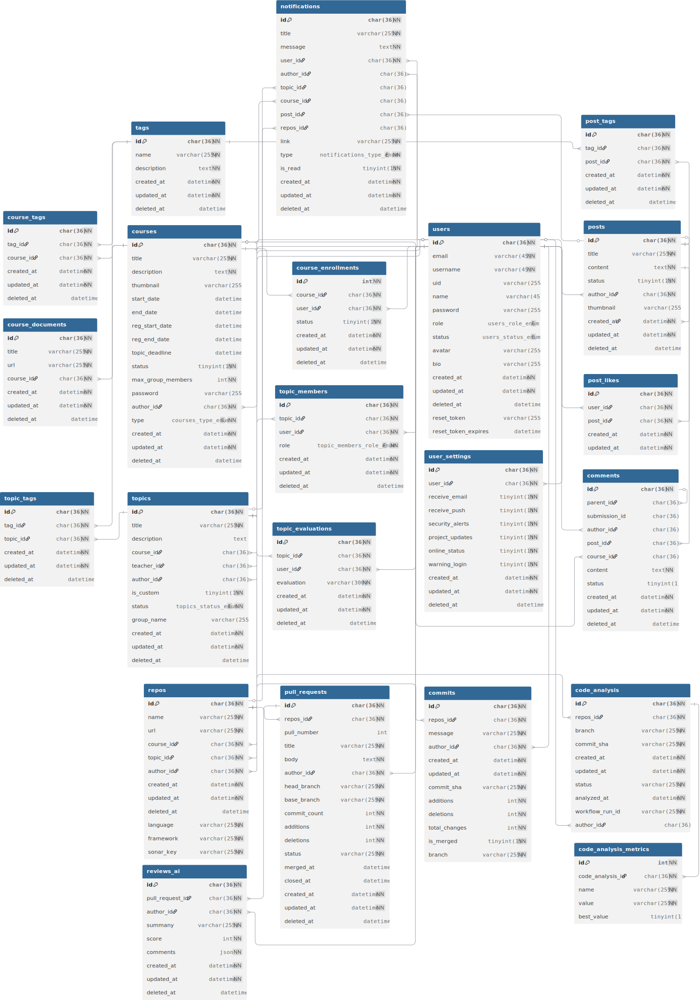

# 📌 CodeFlow - Hệ Thống Quản Lý Dự Án Phần Mềm Tích Hợp GitHub


[](https://github.com/tanmaiii/tn-da21ttb-110121063-dinhtanmai-codeflow/stargazers) [](https://github.com/tanmaiii/tn-da21ttb-110121063-dinhtanmai-codeflow/network/members) [](https://github.com/tanmaiii/tn-da21ttb-110121063-dinhtanmai-codeflow/blob/main/LICENSE)
[](https://github.com/tanmaiii/tn-da21ttb-110121063-dinhtanmai-codeflow/issues) [](https://github.com/tanmaiii/tn-da21ttb-110121063-dinhtanmai-codeflow/commits/main) [](https://github.com/tanmaiii/tn-da21ttb-110121063-dinhtanmai-codeflow/graphs/contributors)

- Giáo viên hướng dẫn: TS. Nguyễn Bảo Ân
- Sinh viên thực hiện: Đinh Tấn Mãi
- MSSV: 110121063
- Email: dinhtanmaivn@gmail.com

## 🔗 Yêu cầu đề tài

Hệ thống toàn diện để quản lý dự án phần mềm sinh viên, tích hợp GitHub để theo dõi tiến độ, đánh giá chất lượng mã nguồn tự động, và cung cấp dashboard phân tích đóng góp chi tiết của từng thành viên nhóm.

## 📖 Giới thiệu

**CodeFlow** là nền tảng quản lý dự án phần mềm hiện đại được thiết kế dành riêng cho môi trường giáo dục. Hệ thống tích hợp sâu với GitHub để cung cấp trải nghiệm quản lý dự án liền mạch, từ việc tạo môn học, phân công đề tài đến theo dõi tiến độ và đánh giá chất lượng mã nguồn tự động.

---

## 🎯 Mục tiêu dự án

- Quản lý đề tài, nhóm sinh viên và tiến độ dự án phần mềm.
- Tự động lấy thông tin commit, pull request từ GitHub qua webhook.
- Tự động kiểm tra chất lượng mã nguồn qua GitHub Actions.
- Thống kê số lần nộp bài, đóng góp từng thành viên.
- Hiển thị dữ liệu trên dashboard cho giảng viên và sinh viên theo dõi.

---

## 🛠️ Công nghệ sử dụng

### Backend

- **Runtime**: Node.js với TypeScript
- **Framework**: Express.js
- **Database**: MySQL với Sequelize ORM
- **Authentication**: GitHub OAuth 2.0
- **API**: RESTful API với Swagger documentation
- **Real-time**: GitHub Webhooks

### Frontend

- **Framework**: Next.js 14 với TypeScript
- **Styling**: Tailwind CSS + Shadcn/ui
- **State Management**: React Query (TanStack Query)
- **Internationalization**: next-intl (Tiếng Việt, English, Japanese)
- **Charts**: Recharts, Chart.js
- **Rich Text Editor**: TipTap

### GitHub Integration & AI

- **GitHub API**: Repositories, Commits, Pull Requests
- **GitHub Actions**: Automated CI/CD workflows
- **GitHub Webhooks**: Real-time event processing
- **🤖 Google Gemini AI**: Advanced AI code review và analysis
- **Code Analysis**: SonarCloud + Gemini AI dual analysis
- **Intelligent Code Review**: AI-powered suggestions và feedback

### DevOps & Deployment

- **Containerization**: Docker
- **Deployment**: Railway / Vercel / Render
- **Environment**: Docker Compose for development

---

## ⚙️ Kiến trúc Hệ thống


### 🏗️ Architecture Overview




### 📂 Database Schema

- **Users**: Thông tin người dùng, GitHub integration
- **Courses**: Môn học, metadata, settings
- **Topics**: Đề tài dự án, requirements, deadlines
- **Repositories**: GitHub repos liên kết với topics
- **Commits**: Tracking commits từ GitHub
- **CodeAnalysis**: Kết quả phân tích chất lượng mã
- **PullRequests**: Quản lý pull requests
- **Comments**: Hệ thống bình luận đa cấp
- **Posts**: Bài viết, thảo luận
- **Tags**: Tagging system cho content
- **Notifications**: Hệ thống thông báo

### 🔧 Development Workflow

1. **Environment Setup**: Docker-based development environment
2. **Code Development**: TypeScript với strict type checking
3. **Testing**: Unit tests, integration tests
4. **Code Quality**: ESLint, Prettier, SonarCloud
5. **CI/CD**: GitHub Actions cho automated testing
6. **Deployment**: Containerized deployment

> ### 🤖 ** AI Code Review với Google Gemini**
>
> **CodeFlow** tích hợp **Google Gemini 1.5 Flash AI** để review code tự động!
>
> - ✨ **AI review Pull Request** bằng tiếng Việt
> - 🎯 **Chấm điểm 0-10** cho chất lượng code
> - 💬 **Comment trực tiếp** trên GitHub PR
> - 🔍 **Phân tích đa chiều**: Bug, Security, Performance, Readability
> - 🚀 **One-click review** - Click và AI sẽ analyze toàn bộ PR

---

## 📅 Kế hoạch thực hiện

| Tuần        | Công việc chính                                                             |
| :---------- | :-------------------------------------------------------------------------- |
| 07/04-13/04 | Xác định đề tài, viết đề cương, phân tích yêu cầu, nghiên cứu công nghệ     |
| 14/04-20/04 | Nghiên cứu GitHub API, OAuth, Webhook, Actions, setup môi trường phát triển |
| 21/04-27/04 | Thiết kế CSDL, vẽ sơ đồ hệ thống, thiết kế cấu trúc thư mục                 |
| 28/04-04/05 | Xây dựng API người dùng, môn học, đề tài. OAuth GitHub                      |
| 05/05-11/05 | Xây dựng chức năng đăng ký đề tài, tạo nhóm, phân quyền nhóm                |
| 12/05-18/05 | Thiết lập webhook, xử lý dữ liệu commit, lưu vào CSDL                       |
| 19/05-25/05 | Cấu hình GitHub Actions, workflow kiểm tra mã, ghi nhận kết quả             |
| 26/05-01/06 | Xây dựng frontend quản lý môn học, đề tài, nhóm                             |
| 02/06-08/06 | Hoàn thiện dashboard thống kê đóng góp, kết nối frontend-backend            |
| 09/06-15/06 | Hoàn thiện tính năng, kiểm thử toàn bộ, triển khai hệ thống demo            |
| 16/06       | Tổng kết kết quả, viết báo cáo, chuẩn bị thuyết trình                       |

---

## 📚 Tài liệu tham khảo

[1] Node.js Foundation, “Node.js Documentation,” [Online]. Available: https://nodejs.org/en/docs/.

[2] Express.js, “Express - Node.js web application framework,” [Online]. Available: https://expressjs.com/.

[3] Sequelize, “Sequelize ORM Documentation,” [Online]. Available: https://sequelize.org/docs/v6/.

[4] Vercel Inc, “Next.js Documentation,” [Online]. Available: https://nextjs.org/docs.

[5] GitHub, “GitHub API Documentation,” [Online]. Available: https://docs.github.com/en/rest.

[6] GitHub, “GitHub Webhooks Documentation,” [Online]. Available: https://docs.github.com/en/webhooks.

[7] GitHub, “GitHub Actions Documentation,” [Online]. Available: https://docs.github.com/en/actions.

---

## 🚀 Quick Start

### Prerequisites

- Node.js 18+ và npm/yarn
- MySQL 8.0+
- Docker & Docker Compose (optional)
- GitHub OAuth App credentials

### Installation

```bash
# Clone repository
git clone git@github.com:tanmaiii/tn-da21ttb-110121063-dinhtanmai-codeflow.git
cd codeflow

# Setup backend
cd src/server
npm install
cp .env.example .env
# Configure database và GitHub OAuth trong .env

# Setup frontend
cd ../client
npm install
cp .env.example .env.local
# Configure API endpoints

# Run with Docker Compose
docker-compose up -d

# Or run manually
cd src/server && npm run dev
cd src/client && npm run dev
```

### GitHub Integration Setup

1. **GitHub OAuth App**:

   - Tạo tại https://github.com/settings/applications/new
   - Callback URL: `http://localhost:3000/api/auth/github/callback`
   - Copy Client ID và Client Secret vào `.env`

2. **Gemini AI Configuration**:

   ```bash
   # Lấy Gemini API key từ Google AI Studio
   GEMINI_TOKEN=your_gemini_api_key_here
   ```

3. **GitHub Webhooks**:

   - Cấu hình webhook cho repositories cần tracking
   - Events: `push`, `pull_request`, `pull_request_review`

4. **Repository Permissions**:
   - Đảm bảo GitHub App có quyền:
   - `repo`, `pull_requests:write`, `contents:read`

---

## 🤖 Hướng dẫn sử dụng AI Review với Gemini

### 🔧 Cấu hình ban đầu

1. **Admin Configuration**:

   - Đăng nhập với tài khoản Admin
   - Vào `Settings > AI Configuration`
   - Nhập **Gemini API Key** (lấy từ [Google AI Studio](https://aistudio.google.com/))
   - Test connection để đảm bảo API hoạt động

2. **Repository Setup**:
   - Đảm bảo repository đã được kết nối với hệ thống
   - GitHub App cần có quyền `pull_requests:write` để comment

### 📝 Quy trình Review

1. **Tạo Pull Request**:

   ```bash
   # Sinh viên tạo branch và push code
   git checkout -b feature/new-feature
   git add .
   git commit -m "Add new feature"
   git push origin feature/new-feature

   # Tạo PR trên GitHub
   ```

2. **Trigger AI Review**:

   - Vào trang `Repository > Pull Requests` trong hệ thống
   - Click nút **"🤖 AI Review"** trên PR muốn review
   - Hệ thống sẽ gửi code diff tới Gemini AI

3. **Kết quả Review**:
   - **GitHub Comments**: AI sẽ comment trực tiếp trên PR
   - **Score Display**: Điểm 0-10 hiển thị trên UI
   - **Summary**: Tóm tắt đánh giá tổng quan

### 💡 Tips cho Sinh viên

1. **Trước khi tạo PR**:

   - Self-review code trước khi push
   - Viết commit message rõ ràng
   - Thêm mô tả chi tiết cho PR

2. **Sau khi nhận AI Review**:

   - Đọc kỹ từng comment của AI
   - Implement suggestions quan trọng
   - Push updates và request review lại nếu cần

3. **Best Practices**:
   - Tạo PR nhỏ, focused (dưới 500 lines)
   - Viết code comments cho logic phức tạp
   - Follow team coding standards

### ⚠️ Lưu ý quan trọng

- **Token Limits**: Gemini có giới hạn token, PR quá lớn có thể bị reject
- **Language**: AI review chủ yếu bằng tiếng Việt
- **Manual Review**: AI không thay thế hoàn toàn human review
- **Cost Management**: Admin cần monitor API usage

---

## 📱 Screenshots & Demo


## 🤝 Contributing

Chúng tôi hoan nghênh mọi đóng góp! Vui lòng đọc [CONTRIBUTING.md](https://github.com/tanmaiii/tn-da21ttb-110121063-dinhtanmai-codeflow?tab=contributing-ov-file) để biết thêm chi tiết.

---

## 🐛 Bug Reports & Feature Requests

- [⛔ Báo Cáo Lỗi](https://github.com/tanmaiii/tn-da21ttb-110121063-dinhtanmai-codeflow/issues/new?template=bug_report.md&title=[Bug])
- [🆕 Yêu Cầu Tính Năng](https://github.com/tanmaiii/tn-da21ttb-110121063-dinhtanmai-codeflow/issues/new?template=feature_request.md&title=[Feature+Request])

- 📧 **Support**: Email hỗ trợ tại dinhtanmaivn@gmail.com

---

## 📌 License

© 2025 by Đinh Tấn Mãi. Dự án phục vụ mục đích học tập và nghiên cứu.
